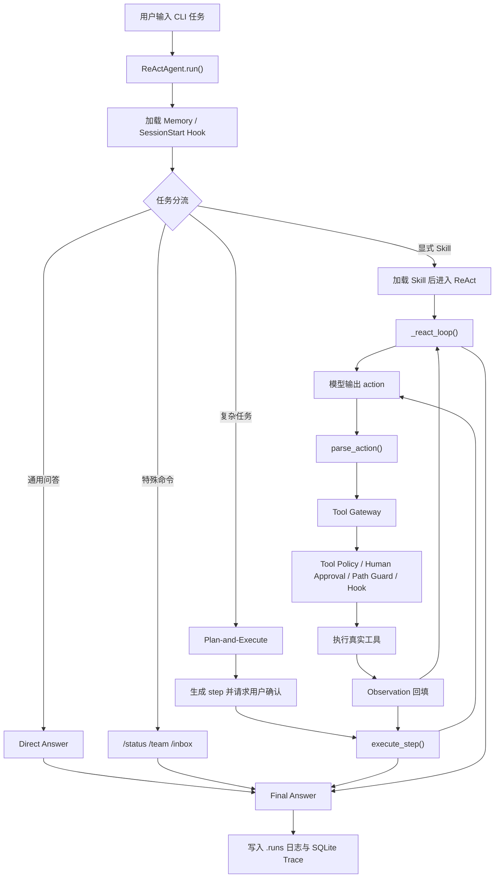

# Python ReAct Agent Runtime

## 项目一句话介绍

这是一个以命令行为入口的 AI Agent Runtime：它把大模型从“只会回答”扩展成“能规划任务、调用工具、读取真实环境反馈并留下可复盘记录”的执行系统，主要解决复杂任务执行时工具调用混乱、过程不可追踪、权限边界不清晰的问题。

## 项目亮点 / 核心能力

1. **Plan-and-Execute + ReAct 执行闭环**  
   复杂任务先拆成步骤，每一步再通过 Thought / Action / Observation 循环执行，避免模型一次性凭印象回答。

2. **统一工具网关 + 权限策略**  
   文件读写、搜索、终端命令、RAG 查询、MCP 工具都会先经过同一个 Tool Gateway，再由 Tool Policy 判断是否允许、阻断或要求人工确认。

3. **Skills 技能系统**  
   高频任务可以沉淀成 `skills/*/SKILL.md`，启动时只加载轻量清单，真正命中任务时再按需加载正文，减少无关提示词干扰。

4. **MCP 工具接入**  
   支持从 `.mcp/config.json` 加载 stdio MCP server，并把外部工具包装成 Agent 可调用的 `mcp_xxx_xxx` 工具；内置 `repo_intel` 仓库分析 server。

5. **Trace 与运行日志**  
   每次运行会写入 `.runs/*.log` 和 SQLite trace，记录 plan、thought、action、tool_result、tool_policy、evidence_ledger 和 final_answer，便于面试演示与问题复盘。

6. **Skills / Memory / RAG 扩展能力**  
   支持技能按需加载、用户明确记忆落盘和本地知识库查询，用于展示 Agent Runtime 的能力扩展方式。

## 技术栈

- **语言与入口**：Python 3.11+、Click CLI
- **模型调用**：MiniMax API，使用 OpenAI-compatible SDK 调用
- **Agent 编排**：自研 ReAct / Plan-and-Execute Runtime
- **工具接入**：本地 Python tools、MCP stdio server
- **知识库**：SentenceTransformers、ChromaDB、pypdf、python-docx
- **可观测性**：SQLite Trace Store、结构化 run log
- **测试与评估**：本地测试脚本、scripted eval suite

## 系统架构 / 流程图



## 核心模块说明

| 模块 | 位置 | 作用 |
|---|---|---|
| Agent Runtime | `agent.py` | 主执行入口，负责任务分流、规划、ReAct 循环、工具调度和最终汇总 |
| Action Parser | `agent.py::parse_action` | 把模型输出的 `tool_name(...)` 文本解析成工具名和参数，不使用 `eval` |
| Tool Gateway | `agent.py::_run_tool_with_hooks` | 所有真实工具执行前的统一入口，串起策略、审批、路径校验、Hook 和 trace |
| Tool Policy | `tool_policy.py` | 定义工具风险等级、危险命令阻断、人工确认和 allowed_roots 路径边界 |
| Tool Layer | `tools.py` | 实现读文件、写文件、列目录、搜索、终端命令、联网搜索和知识库查询 |
| Skill Registry | `skills.py` | 发现 skills、匹配关键词、按需加载 `SKILL.md` 正文 |
| Memory Store | `memory.py` | 将用户明确要求保存的信息写入 Markdown，并在后续任务中作为轻量记忆注入 prompt |
| MCP Client / Registry | `internal_mcp/` | 加载 MCP server，连接 stdio，会把 MCP tools 包装成本地工具 |
| Repo Intel MCP Server | `internal_mcp/servers/repo_intel_server.py` | 提供符号查找、引用搜索、模块职责总结和变更影响面分析 |
| RAG Pipeline | `rag/` | 解析 md/txt/docx/pdf，构建 chunk、embedding 和 ChromaDB 索引 |
| Trace Store | `run_traces.py` | 使用 SQLite 保存结构化运行轨迹，并提供格式化报告 |

## 快速启动

### 1. 安装依赖

```powershell
git clone https://github.com/yifanguo233-arch/python-react-agent-runtime.git
cd python-react-agent-runtime
uv sync
```

如果已经有 `.venv`，也可以直接使用项目虚拟环境：

```powershell
.\.venv\Scripts\python.exe --version
```

### 2. 配置环境变量

复制示例环境变量文件：

```powershell
Copy-Item .env.example .env
```

然后编辑 `.env`：

```env
MINIMAX_API_KEY=your_minimax_api_key
MINIMAX_BASE_URL=https://api.minimaxi.com/v1
AGENT_TRACE_DB=.runs/traces.sqlite3
```

`MINIMAX_BASE_URL` 不填时默认使用 `https://api.minimaxi.com/v1`。
`AGENT_TRACE_DB` 不填时默认写入项目本地 `.runs/traces.sqlite3`。

### 3. 启动 Agent

```powershell
.\.venv\Scripts\python.exe agent.py .
```

指定模型：

```powershell
.\.venv\Scripts\python.exe agent.py . --model minimax/MiniMax-M2.7
```

### 4. 构建本地知识库索引（可选）

只有需要演示 RAG 查询时才需要执行：

```powershell
.\.venv\Scripts\python.exe rag\build_index.py
```

## 接口或运行示例

### CLI 示例 1：分析当前项目

```text
/analyze-code 请分析这个项目，输出项目结构、核心模块、执行链路、风险点和改进建议。
```

预期现象：

- Agent 会加载 `analyze-code` 技能
- 读取 README、目录和核心源码文件
- 输出基于 observation 的项目分析
- `.runs/` 中生成运行日志和 SQLite trace

### CLI 示例 2：查看 MCP 状态

```text
/status
```

预期输出包含：

```text
# Agent Status
- 模型后端：MiniMax API (...)

# MCP Status
- 已配置 server：1
- 已连接 server：1
- 已加载 MCP tools：4
```

### CLI 示例 3：演示权限边界

```text
请列出 C:/Users/lenovo/Desktop 目录下的文件。
```

预期现象：

- Agent 尝试调用目录工具
- Tool Policy / 路径校验会阻止访问项目目录外路径
- Trace 中会记录对应的 policy 或 observation 信息

## 测试与结果

### 运行稳定测试

```powershell
.\.venv\Scripts\python.exe scripts\run_tests.py
```

也可以使用 uv 直接运行：

```powershell
uv run python scripts/run_tests.py
```

说明：当前仓库的测试入口是本地稳定测试脚本，逐个运行 `test/test_*.py` 文件；它不是依赖 pytest runner 的完整 pytest 工程。

测试覆盖方向：

- Memory 保存与注入
- Skills 轻量发现与按需加载
- Hook 生命周期行为
- Tool Policy 阻断和 allowed_roots
- ReAct action / observation / final_answer 协议
- 重复读取阻断和 evidence ledger
- MCP config / registry / repo_intel server
- SQLite trace 写入与查看

### 运行 Agent Eval Suite

```powershell
.\.venv\Scripts\python.exe scripts\run_evals.py
```

当前 eval 是 scripted workflow grading，用于验证 Agent 执行链路稳定性。示例报告形态：

```text
total=50
pass=50
pass_rate=100%
avg_steps=2.8
tool_error_rate=5.9%
repeated_read_blocked=8
```

### 查看 Trace

```powershell
.\.venv\Scripts\python.exe scripts\view_runs.py list
.\.venv\Scripts\python.exe scripts\view_runs.py show
```

Trace 报告会展示：

- Plan
- Thought
- Action
- Tool Result
- Tool Policy audit
- Human approval
- Evidence Ledger
- Final Answer

## 项目边界 / 后续优化

当前项目是一个可运行、可测试的 Agent 工程原型，不是生产级平台。需要明确的边界包括：

- **不是完整 Web 服务**：当前入口是 CLI，没有提供 FastAPI / Web UI。
- **不是生产级沙箱**：Tool Policy 和路径校验在 Agent 层工作，不等于 OS 级隔离。
- **不是大规模 RAG 产品**：RAG 适合本地文档查询，未接入重型 reranker、表格解析和多模态文档处理。
- **模型后端当前收敛到 MiniMax**：运行时只允许 MiniMax 模型。
- **Eval 是 scripted workflow eval**：能验证执行链路，不等同于大规模真实模型 benchmark。

后续优化方向：

1. 引入更严格的 JSON schema / function calling 协议，减少 XML 文本解析不稳定性。
2. 增加 Web API 或 UI，方便演示和集成。
3. 强化沙箱执行能力，把高风险命令放进更严格的隔离环境。
4. 改进 RAG 检索质量，引入更强 rerank、表格/PDF 结构解析和引用定位。
5. 扩展真实 MCP server 生态，并为不同 server 增加独立 trust policy。

## 来源与声明

本项目为学习和面试展示用途的工程化 Agent 原型，重点在于从代码层实现 ReAct、工具调用、Skills、MCP、Tool Policy、Trace、Memory 和 RAG 等机制。

项目参考了开源 Agent / ReAct / MCP / RAG 相关思想，并在本仓库中进行了手写实现和工程化改造。README 中描述的是当前代码已经实现或可运行演示的能力；未实现的能力已在“项目边界 / 后续优化”中明确说明。

特别说明：面试展示资料集中放在 `interview_docs/`。
